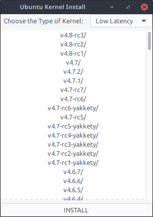

# Ubuntu Kernel Install
Tool to install kernel in Ubuntu and derivatives




# Requirements
 - python3-bs4
 - python3-requests
```sh
$ sudo apt install python3-bs4 python3-requests
```

# Instructions
Download it using this quick link: https://github.com/carlosqsilva/Ubuntu-Kernel-Install/tarball/master

Save the archive and extract the files. Run the `app.py` with:
```sh
$ python3 app.py
```
or
```sh
$ ./app.py
```
